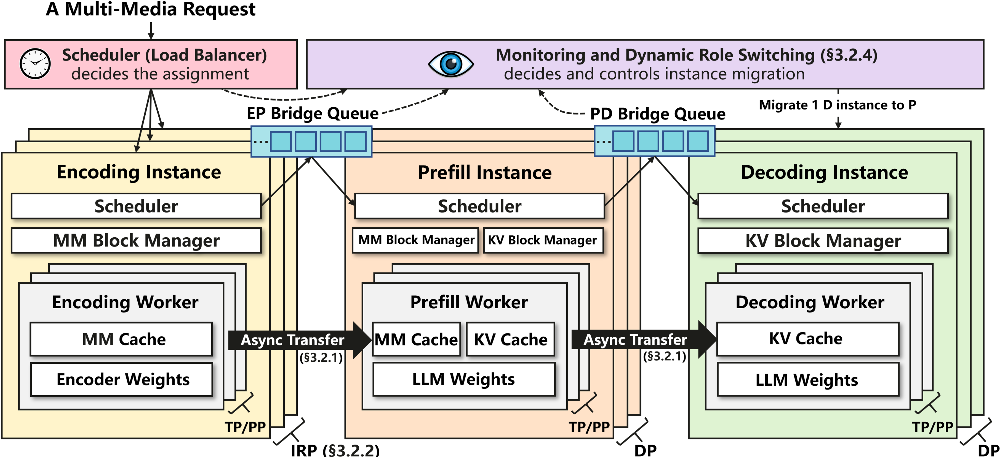

# EPDServe: Disaggregated Serving System for Large Multimodal Models

This is a repo for the paper *Efficiently Serving Large Multimodal Models Using EPD Disaggregation* ([Arxiv link](https://arxiv.org/abs/2501.05460)), accepted at ICML 2025 🎉

Link to Huawei AI Gallery Notebook: [[AI Gallery]](https://developer.huaweicloud.com/develop/aigallery/notebook/detail?id=f118c40f-834f-48e0-be3b-d2d3492ca6e5)

<div align="center">
  
</div>

<br>
EPDServe implements the **Encode-Prefill-Decode (EPD) Disaggregation** architecture proposed in the EPD paper. It is designed to serve large multimodal models (LMMs) efficiently by **splitting the inference pipeline** into three independent stages:

- 🎨 **Encoding Stage**: Processes multimodal inputs (images, audio, video)
- 🧠 **Context (Prefill) Stage**: Handles prompt token prefill
- 🔁 **Decoding Stage**: Performs autoregressive token generation

Each stage operates independently with its own compute resources, scheduler, cache manager, and GPU workers.

### 🚀 Key Features

- Disaggregated multimodal LMM inference
- Independent scaling of encoding, prefill, - and decoding  
- Intra-request parallelism for distributing heavy encoding loads<br>
- Monitiring delays/ bottlenecks at various stages (viz. load estiamtor) <br>
- Cuda-level IPC utilities (csrc) for fast and asynchronous token and model weights transfer <br>
- Dynamic GPU resource reallocation and role switching
- Minimal latency and maximized throughput (TTFT / E2ETP)

It is highly modular, extensible, and tightly aligned with the goals of reducing TTFT and maximizing E2ETP.

---


## 🗂️ Code Structure
### 🐍 Python Code

#### Structure
```text
                                 +---------------------+
                                 |   API Frontend      |
                                 +----------+----------+
                                            |
                 [EPDOrchestrator] [Load Estimator] [Resource Allocator]
                                            |
                        +-------------------+-------------------+
                        |                   |                   |
           [EncodingStageCluster] [ContextStageCluster] [DecodingStageCluster]
                        |                   |                   |
           [EncodingStageEngines] [ContextStageEngines] [DecodingStageEngines]
                        |                   |                   |
                    [Workers]          [Workers]          [Workers]

```

#### Explanation
| Component              | Role                                                                 |
|------------------------|----------------------------------------------------------------------|
| `EPDOrchestrator`      | Top-level pipeline controller                                        |
| `*StageCluster`        | Manages DP stage engines                                             |
| `*StageEngine`         | Runs scheduler, block manager, workers                               |
| `*StageScheduler`      | Forms batches, assigns work                                          |
| `Worker`               | Executes model compute on GPUs, manages weights & cache       |
| `BlockManager`         | Allocates/free cache blocks                                          |
| `LoadEstimator`        | Tracks system metrics                                                |
| `ResourceAllocator`    | Decides dynamic stage reassignments                                  |
| `api_server` / `Request` | Provides RESTful APIs and tracks request info                     |


For mode details look at [README_CODE.md](README_CODE.md)

### ⚡C++/ CUDA utils
EPD disaggregation relies on custom CUDA/C++ utilities to enable high-performance inter-process GPU communication for cache and model weight management.<br>These components, implemented in the csrc/ folder, provide the core infrastructure for fast GPU-to-GPU transfers and zero-copy tensor sharing. 

#### Explanation
| File            | Purpose                                                                 |
|-----------------|-------------------------------------------------------------------------|
| `block_migration.cpp` | Custom cache block migration for KV/MM caches (adapted for vLLM) |
| `zero_copy.py`       | Zero-copy model sharing across processes via CUDA IPC             |
| `zero_copy.py`       | GPU-to-GPU async weight transfer using NCCL/NVLink          |
| `py_nccl.cc`         | Python binding for NCCL unique ID generation                      |


For mode details look at [README_CUDA.md](csrc/README_CUDA.md)

## 🔧 Setup

### Requirements
- Minimum **4 GPUs** (8+ recommended, CUDA Compute Capability 8.0+)
- **Python 3.10.14**
- **CUDA Toolkit** 12.1 (`nvcc` version: `release 12.1, V12.1.66`)
- **CUDA Driver** ≥ 525.105.17
- **System CUDA** version: 12.0
- **vLLM** version 0.6.1.post2

---

### Obtain code from AI gallary

```bash
!wget https://vbdai-notebooks.obs.cn-north-4.myhuaweicloud.com/epdserve/code.zip 
!unzip -qo code.zip
cd EPD-Disaggregation
```

### Create Conda Environment

```bash
conda env create -f env.yml
```

---

### Make edits in vllm
``` bash
# Get path to vllm folder
python -c "import vllm; print(vllm.__path__)"
# Output -> ['<path_to_vllm>']
code <path_to_vllm>/transformers_utils/image_processor.py
```

#### Replace line 34 (function arguments of get_image_processor) with the following
``` python
    trust_remote_code: bool = True,
```

### Build CUDA Utilities

To enable fast inter-stage communication via shared memory:

```bash
cd csrc
mkdir build && cd build
cmake ..
make
```

This generates the `libcuda_ipc_utils.so` needed for running.

---

## 🚀 Running the EPD System
Go the the root folder
``` sh
cd <project_root>
```

### 🧪 Offline Mode

Run end-to-end disaggregated inference with offline requests:

```bash
export CUDA_IPC_LIB_PATH=./csrc/build/libcuda_ipc_utils.so
python offline.py
```

---

### 🌐 Online API Server

Start the server:

```bash
export CUDA_IPC_LIB_PATH=./csrc/build/libcuda_ipc_utils.so
sh launch_server.sh
```

Send a request (in a separate terminal):

```bash
export CUDA_IPC_LIB_PATH=./csrc/build/libcuda_ipc_utils.so
python online.py
```

---

## Running baselines
### DistServe (PD)
```bash
cd baselines/pd
export CUDA_IPC_LIB_PATH=./csrc/build/libcuda_ipc_utils.so

# Offline
python offline.py

# Online (same as above)
sh launch_server.sh
python online.py
```


### Aggregated/ vLLM (D)
```bash
cd baselines/d
export CUDA_IPC_LIB_PATH=./csrc/build/libcuda_ipc_utils.so

# Offline
python offline.py

# Online (same as above)
sh launch_server.sh
python online.py
```


## Experiments
### SLO plots for synthetic workload
``` bash
cd <project_root>
# Run all baselines. Can configure request rates, model, #images, etc.
python automate_e2e.py

# Plot (TTFT and SLO) and analyze results
cd experiments/intra_req_dp_e2e
python analyze.ipynb
```


### Role switching (offline analysis)
``` bash
# Run without dynamic role swiyching
## Change line 44 to 'orchestrator_class = EPDOrchestrator' 
python offline.py # e2e time ~68s

# Run with dynamic role switching
## Change line 44 to 'orchestrator_class = DynamicEPDOrchestrator'
python offline.py #e2e time ~25s
```


## References: 
The code is implemented based on [Dist-Serve](https://github.com/LLMServe/DistServe), and [vLLM](https://github.com/vllm-project/vllm). We thanks the contributors for their great work!

## Citation 
If this code is useful, please cite it in your documents.
```
@misc{singh2025efficientlyservinglargemultimodal,
      title={Efficiently Serving Large Multimodal Models Using EPD Disaggregation}, 
      author={Gursimran Singh and Xinglu Wang and Yifan Hu and Timothy Yu and Linzi Xing and Wei Jiang and Zhefeng Wang and Xiaolong Bai and Yi Li and Ying Xiong and Yong Zhang and Zhenan Fan},
      year={2025},
      eprint={2501.05460},
      archivePrefix={arXiv},
      primaryClass={cs.DC},
      url={https://arxiv.org/abs/2501.05460}, 
}
```
Shield: [![CC BY-NC 4.0][cc-by-nc-shield]][cc-by-nc]

This work is licensed under a
[Creative Commons Attribution-NonCommercial 4.0 International License][cc-by-nc].

[![CC BY-NC 4.0][cc-by-nc-image]][cc-by-nc]

[cc-by-nc]: https://creativecommons.org/licenses/by-nc/4.0/
[cc-by-nc-image]: https://licensebuttons.net/l/by-nc/4.0/88x31.png
[cc-by-nc-shield]: https://img.shields.io/badge/License-CC%20BY--NC%204.0-lightgrey.svg
