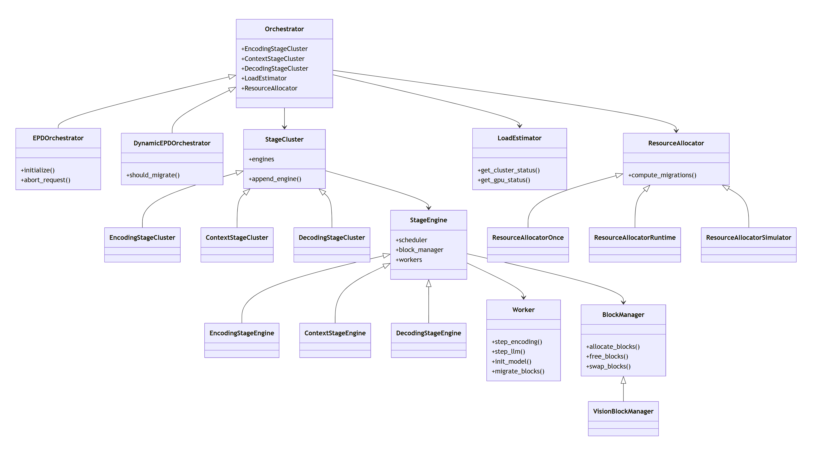
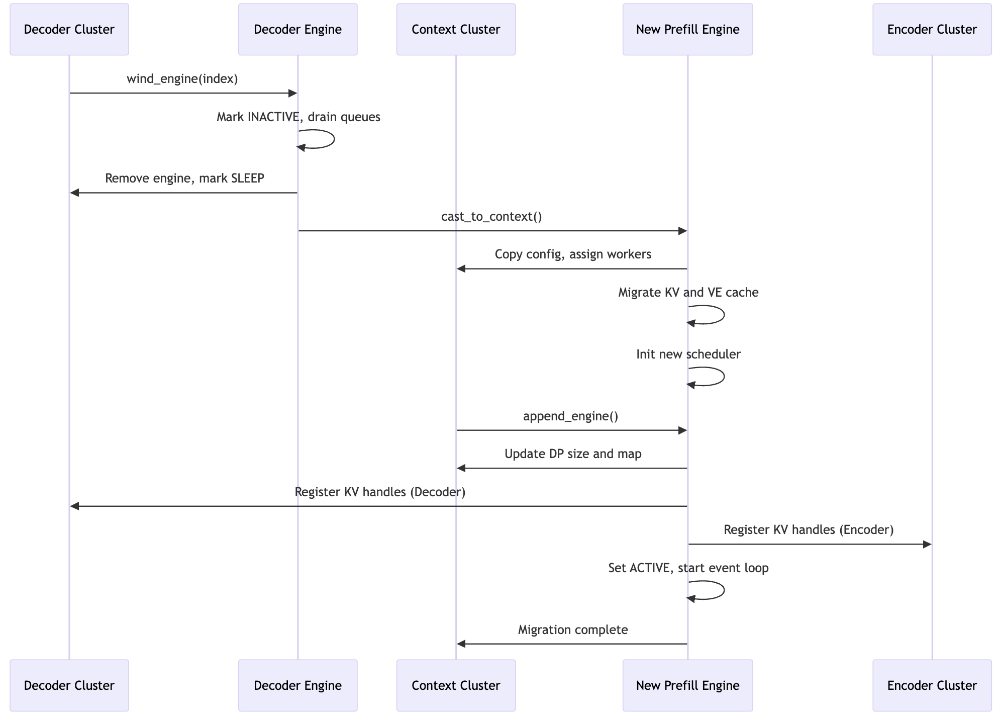

## 🔧 **Core Idea**

EPDServe implements a **disaggregated LMM serving pipeline**, where **Encoding**, **Context (Prefill)**, and **Decoding** stages are split and run independently, yet coordinate efficiently to serve multimodal requests at scale.

## 📁 Codebase Structure (High-Level)
``` text
EPD-Disaggregation/
├── assets/                       # Supporting assets for testing or demos
│   ├── images/                   # Sample input images
│   └── models/                   # Pre-downloaded model checkpoints
│
├── baselines/                    # Baseline systems (LLaVA-style)
│   ├── d/                        # Disaggregated baselines
│   │   └── distserve/           # Components similar to `epdserve` for comparison
│   └── pd/                      # Partially disaggregated baselines
│       └── distserve/
│
├── csrc/                        # C++/CUDA custom extensions
│   ├── build/                   # Build output (ignore in version control)
│   ├── *.cpp / *.h              # NCCL / CUDA IPC integration headers and sources
│   └── CMakeLists.txt           # CMake config for building shared libraries
│
├── epdserve/                    # 🚀 Main EPD disaggregated serving engine
│   ├── api_server.py            # OpenAI-style multimodal API frontend
│   ├── block_manager.py         # GPU/CPU cache block management
│   ├── config.py                # Parallel/model/cache configuration utilities
│   ├── engine_common.py         # Shared abstractions across all stage engines
│   ├── engine_encoding.py       # EncodingStageEngine + Cluster
│   ├── engine_context.py        # ContextStageEngine + Cluster
│   ├── engine_decoding.py       # DecodingStageEngine + Cluster
│   ├── lifetime.py              # Lifetime event tracking for analysis/debugging
│   ├── llm_async.py             # Online pipeline handler
│   ├── llm_offline.py           # Offline pipeline handler
│   ├── logger.py                # Logging utilities
│   ├── orchestrator.py          # EPDOrchestrator and DynamicEPDOrchestrator
│   ├── request.py               # Request lifecycle, batching, metadata
│   ├── resource_allocation.py   # LoadEstimator and ResourceAllocator logic
│   ├── scheduler_encoding.py    # Encoding stage scheduler
│   ├── scheduler_context.py     # Context (prefill) stage scheduler
│   ├── scheduler_decoding.py    # Decoding stage scheduler
│   ├── tokenizer.py             # Tokenizer wrapper utilities
│   └── worker.py                # Ray worker logic for all stages
│
├── simulator/                    # Simulator for EPD disaggregated serving engine
├── automate_e2e.py               # Script to automate full pipeline tests
├── launch_server.sh              # Launching EPD server for online inference
├── online.py                     # Entry for online (API-based) benchmarking
├── offline.py                    # Entry for offline (batch) benchmarking
├── structs.py                    # Shared request/response/config dataclasses
└── env.yml                       # Conda environment for reproducibility
```
---
## 🧱 Class structure


---

## 🧠 **Top-Level Coordination**
### `EPDOrchestrator` (in `orchestrator.py`)
- Acts as the **central controller** of the system.
- Owns and coordinates:
  - `EncodingStageCluster`
  - `ContextStageCluster`
  - `DecodingStageCluster`
- Interfaces with Ray placement groups and GPU workers.
- Handles lifecycle events and cross-stage cache transfers.

---

## 🧱 **Pipeline Stages (Clusters & Engines)**

### Stage Clusters: 
Each stage (`encoding`, `context`, `decoding`) has its own cluster class:
- `EncodingStageCluster`, `ContextStageCluster`, `DecodingStageCluster`
- Contains multiple **DataParallel** instances of their corresponding `StageEngine`.

### Stage Engines:
- `EncodingStageEngine`, `ContextStageEngine`, `DecodingStageEngine`
- Each engine owns:
  - **A Scheduler** (custom per stage)
  - **Block Managers** (KV + MM cache)
  - **Multiple Workers** (Ray actors with TP/PP weights)

These execute the actual model inference step (encoding tokens, running attention, decoding outputs, etc.).

---

## 🧮 **Schedulers**
Custom for each stage:
- `EncodingStageScheduler`
- `ContextStageScheduler`
- `DecodingStageScheduler`

Responsible for:
- Managing request queues
- Forming batches
- Deciding when requests can move to the next stage
- Supporting dynamic migrations

---

## 📦 **Block Managers**
- `BlockManager` and `VisionBlockManager` (in `block_manager.py`)
- Manage GPU/CPU blocks for KV or MM cache
- Allocate, free, migrate, or swap cache blocks
- Used by workers to access cache regions for a request

---

## 🔌 **Workers** (in `worker.py`)
- GPU-resident Ray actors
- Execute stage-specific computation:
  - `step_encoding()`
  - `step_llm()` (context/decoding)
- Hold:
  - Partitioned/ complete model weights (TP/PP)
  - KV/MM cache memory
- Support zero-copy cache sharing during role switching
- Supports cache blocks transfer between GPUs via NvLink
---

## 🛠️ **Schedulers & Cache Coordination**
Schedulers talk to:
- `BlockManager`: to to mamange blocks for KV Cache
- `VisionBlockManager`: to to mamange blocks for MM Cache
- Workers: to execute batches
- Other stages: to transfer or receive cache blocks during stage transitions

---

## 🧠 **Request Lifecycle & Token Flow**
Requests flow through:
1. `EncodingStageCluster`: handles image/video/audio input encoding
2. → sends multimodal cache to `ContextStageCluster`
3. → performs prefill and sends KV cache to `DecodingStageCluster`
4. → Decoding proceeds autoregressively, batch-wise

Bridges like `encode_context_bridge_queue` and `context_decode_bridge_queue` mediate these transitions.

---

## ⚖️ **Resource Allocation**
- `LoadEstimator` monitors usage of GPU utilization, memory blocks, waiting queues, etc..
- `ResourceAllocator` proposes reconfiguration/migrations.
- `ResourceAllocatorRuntime`: adaptive real-time scheduling according to queuing states.
- `DynamicEPDOrchestrator` extends `EPDOrchestrator` to support **role switching**, i.e., reassigning GPUs between stages dynamically.
- `ResourceAllocatorSimulator`: perioically calling resource allocation module (which involves simlation) and adaptively reconfiguration. 

The simulation relies on the `simulator.simuate_dist.run_experiment`. Given a configuration and workload, this function outputs performance metrics such as SLO attainment and cost. By testing different configurations with varying input request rates, we can predict the goodput metric. This part of the code is built on DistServe's simulation code (simdistserve), but with differences: we need the concept of a cluster (having a data-parallel number of worker instances) and include encoding to simulate EPD disaggregation serving.

---

## 🔁 **Frontend & APIs**
- `api_server.py`: OpenAI-compatible RESTful API frontend
- `AsyncLLM`, `OfflineLLM`: abstractions to support online/offline execution
- `request.py`: holds `Request`, `SamplingParams`, etc.

---


## Dynamic role switching/ worker migration
For more details, of how this works, pease look at code in files orchestrator.py and class DynamicEPDOrchestrator.

### Sequence diagram for D→P migration
